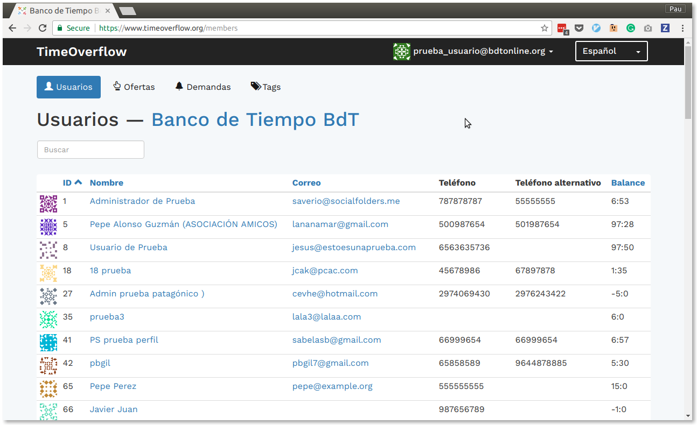
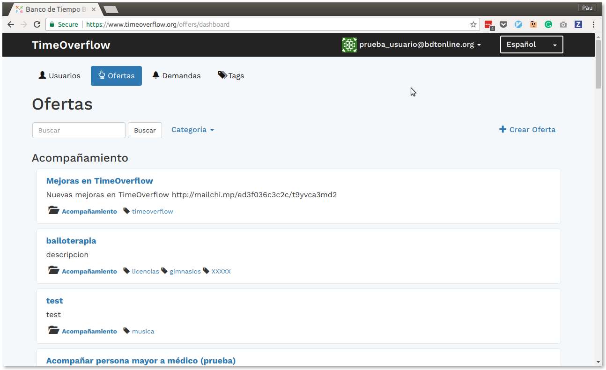

# TimeOverflow    
#### https://www.timeoverflow.org/

:bank: :hourglass: Time Bank management system. [Learn more about Time Banks](http://www.bdtonline.org/)

TimeOverflow is a software developed in an altruistic way to offer a system that
facilitates the interaction of the members and the management of the Time Banks.
The model on which we work is guided by the needs of the Time Banks that make use
of it and is prepared to be able to accommodate several Time Banks in a single installation,
for this account with three levels of privileges: superadmin, admin (only manages a bank)
and members of a bank.

 

TimeOverflow is divided into 2 large blocks:

* ** Management system for administrators **
* ** Social network and online banking for users **

> ** NOTE ** A physical Time Bank can work only with the management block, it could happen, for example, that the vast majority of its members do not use the Internet and may want to operate only with listings, checks and a management office .

## Management system

Physical Time Banks (mainly focused on TimeOverflow) often work without the Internet, perform
lists of services and members and pay the hours with heels that are finally entered in the office, therefore
the management system allows us to manage the members and their services, draw lists and keep accounting.
It is important that Bank managers (admin) have useful information about the community so that they can act on it
(for example, statistics on weak users, incident management, balance of accounts, etc.)

## Social Network and Online Banking

The social network makes it easy for members to meet and meet outside the events scheduled by the Time Bank,
as well as being able to post offers / demand ads explained in detail.

On the other hand the members can be paid the services of virtual way to save the passage through the office of the Bank
of Time and also have the possibility to consult the extract of their account.

# Contributions

## Join the team of collaborators !!

https://github.com/coopdevs/timeoverflow/blob/develop/CONTRIBUTING.md

## License

This is free and unencumbered software released into the public domain.

Anyone is free to copy, modify, publish, use, compile, sell, or
distribute this software, either in source code form or as a compiled
binary, for any purpose, commercial or non-commercial, and by any
means.

In jurisdictions that recognize copyright laws, the author or authors
of this software dedicate any and all copyright interest in the
software to the public domain. We make this dedication for the benefit
of the public at large and to the detriment of our heirs and
successors. We intend this dedication to be an overt act of
relinquishment in perpetuity of all present and future rights to this
software under copyright law.

THE SOFTWARE IS PROVIDED "AS IS", WITHOUT WARRANTY OF ANY KIND,
EXPRESS OR IMPLIED, INCLUDING BUT NOT LIMITED TO THE WARRANTIES OF
MERCHANTABILITY, FITNESS FOR A PARTICULAR PURPOSE AND NONINFRINGEMENT.
IN NO EVENT SHALL THE AUTHORS BE LIABLE FOR ANY CLAIM, DAMAGES OR
OTHER LIABILITY, WHETHER IN AN ACTION OF CONTRACT, TORT OR OTHERWISE,
ARISING FROM, OUT OF OR IN CONNECTION WITH THE SOFTWARE OR THE USE OR
OTHER DEALINGS IN THE SOFTWARE.

For more information, please refer to <http://unlicense.org/>
