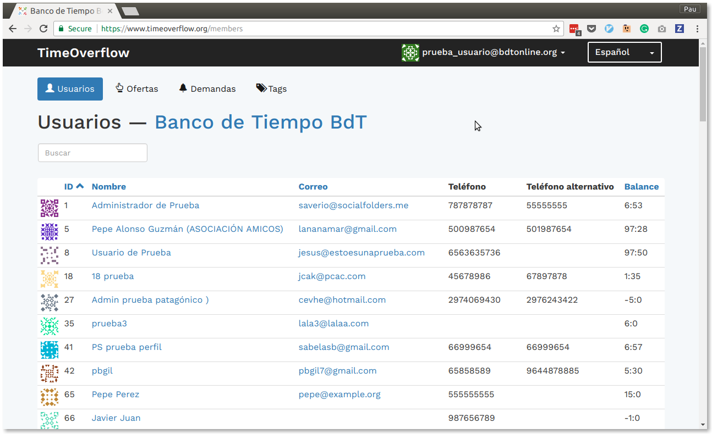
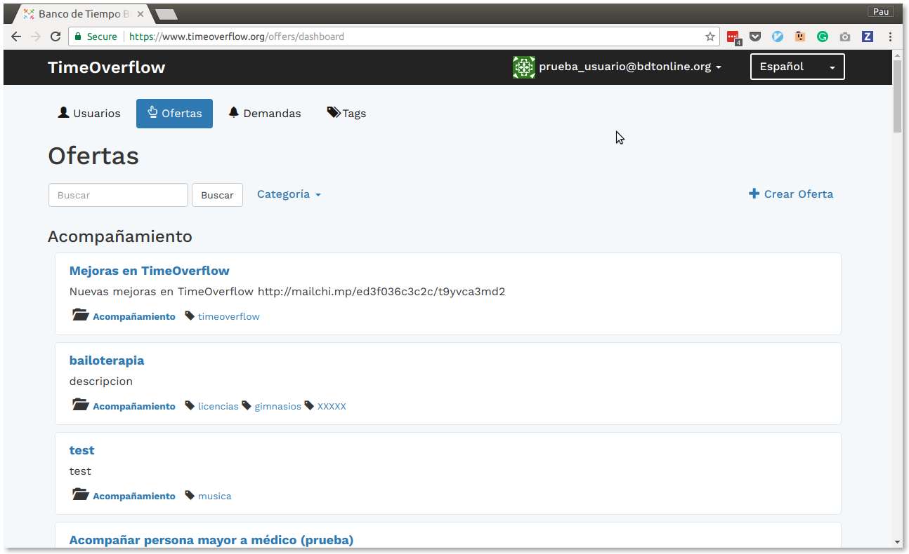

# TimeOverflow  
#### www.timeoverflow.org

:globe_with_meridians: Read this [in English](docs/README.en.md)

:bank: :hourglass: Sistema de gestión de Banco de Tiempo. [Saber más sobre Bancos de Tiempo](http://www.bdtonline.org/)

TimeOverflow es un software desarrollado de manera altruista para ofrecer un sistema que facilite la interacción
de los miembros y la gestión de los Bancos de Tiempo. El modelo sobre el que se trabaja está guiado por las necesidades de los Bancos de Tiempo
que hacen uso de él y está preparado para poder albergar varios Bancos de Tiempo en una sola instalación, para ello cuenta
con tres niveles de privilegios: superadmin, admin (solo gestiona un Banco) y miembros de un Banco.

 

TimeOverflow está dividido en 2 grandes bloques:

* **Sistema de gestión para los administradores**
* **Red social y banca on-line para los usuarios**

> **NOTA** Un Banco de Tiempo físico puede funcionar solo con el bloque de gestión, podría ocurrir, por ejemplo, que la inmensa mayoria de sus miembros no usen Internet y podrían querer funcionar solo con listados, cheques y una oficina de gestión.

## Sistema de gestión

Los Bancos de Tiempo físicos (a los que principalmente se enfoca TimeOverflow) a menudo funcionan sin internet, se realizan
unos listados de servicios y de miembros y se pagan las horas con talones que finalmente se ingresan en la oficina, por tanto
el sistema de gestión nos permite gestionar los miembros y sus servicios, sacar listados y llevar la contabilidad. También
es importante que los gestores del Banco (admin), tengan información útil sobre la comunidad para poder actuar sobre ella
(por ejemplo, estadísticas sobre usuarios poco activos, gestión de incidencias, equilibrio de las cuentas, etc)

## Red social y banca on-line

La red social facilita a los miembros encontrarse y conocerse fuera de los eventos programados por el Banco de Tiempo,
así como poder publicar anuncios de ofertas/demandas explicados en detalle.

Por otro lado los miembros pueden pagarse los servicios de manera virtual para ahorrarse el paso por la oficina del Banco
de Tiempo y también tienen la posibilidad de consultar el extracto de su cuenta.

# Contribuciones

**Únete al equipo de colaboradores!**

:point_right: Más información [aquí](CONTRIBUTING.md).

# Licencia

> The Unlicense

Puedes consultar la licencia [aquí](UNLICENSE).
